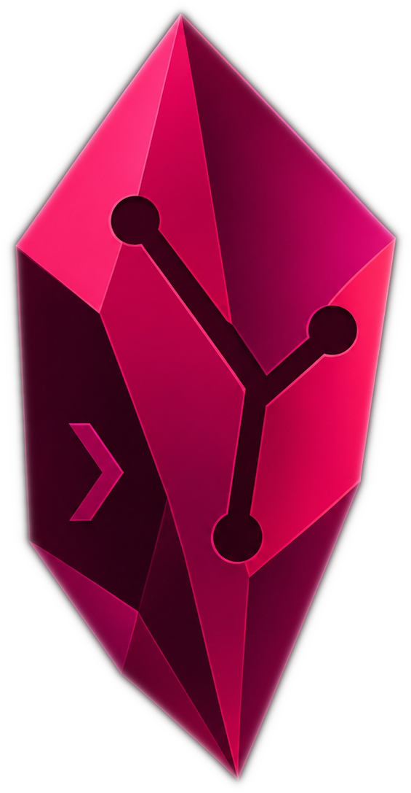
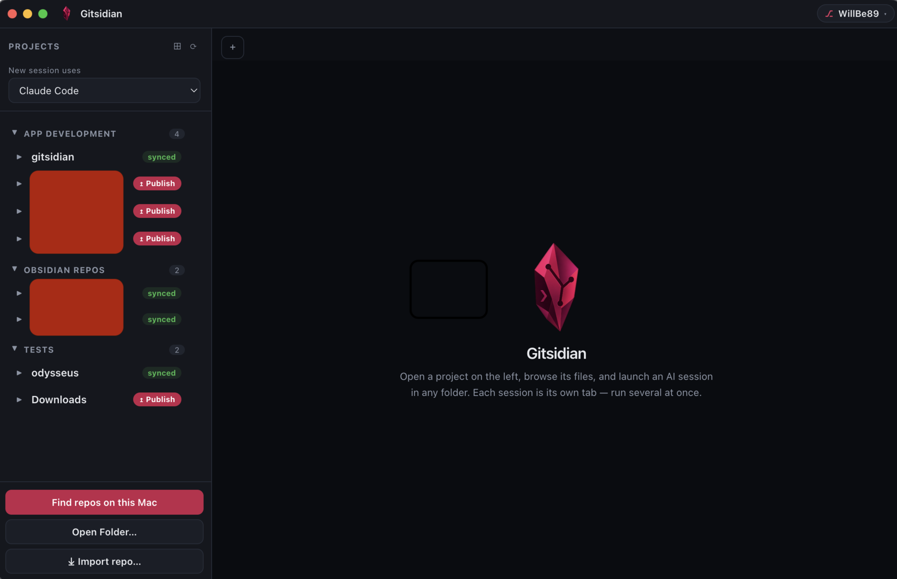
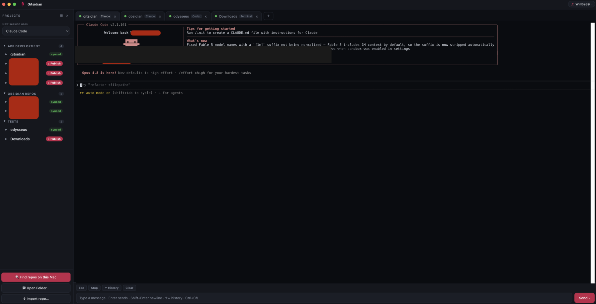

<div align="center">



# Gitsidian

### Your AI coding cockpit — edit code, run any AI, handle git, and chat with your team, all in one window.

**No terminal required.** Open any git repo or Obsidian vault; edit files with real syntax highlighting; run Claude Code, Codex, Ollama, or a shell — several at once, each a live tab. Then review, stage, commit, push, open PRs, and message your team — without leaving the app or memorising a single command.

[](https://github.com/WillBe89/gitsidian/releases/latest)
[](https://github.com/WillBe89/gitsidian/releases/latest)
[](https://github.com/WillBe89/gitsidian/releases/latest)

 

</div>

---

## Highlights

- **Edit code in-app** — a CodeMirror editor with syntax highlighting (~16 languages), find/replace, go-to-line, and Markdown/image preview. A "VSCode-lite" for the quick AI jobs.
- **Run any AI CLI** — Claude Code, Codex, Gemini, Ollama, Aider and more — auto-detected, several at once, each a real terminal in its own tab with a live status light.
- **Git without the terminal** — publish, commit, push, pull, **review & stage** (per-file *or* per-hunk), commit history, branch switching, and **open a PR** — all from the sidebar, with safety guard-rails.
- **Work as a team** — built-in **chat** that uses your GitHub account as your identity (no extra accounts or servers), plus opt-in **AI command dispatch**: propose a prompt a teammate approves and runs in their own session.
- **Make it yours** — dark/light themes, a resizable **split view of any two tabs**, command palette (⌘P), multi-file search, drag-and-drop, paste-an-image, and built-in auto-update.

> **New in 0.6:** a real code editor, review-and-stage with per-hunk commits, team chat, and AI command dispatch.

## Why Gitsidian exists

AI coding assistants (Claude Code, Codex, Ollama and friends) are incredible — but they live in the **terminal**, which is a wall for most people and a juggling act even for developers:

- A blank black window with commands to memorise.
- Running several assistants across different repos means a mess of terminal windows, and no way to tell which one is still thinking.
- Git itself — clone, commit, push, pull — is another set of commands on top.

Gitsidian keeps the terminal's power and aesthetic (each session really *is* a terminal), but wraps it so **anyone can use it**: a sidebar of your projects, real embedded terminals in tabs, one-click git, and clear status everywhere. It was built so a non-technical teammate can drive an AI assistant in the right folder as easily as a developer can run ten of them at once.

## Who it's for

- **Developers** who want to run multiple AI coding sessions side by side, across repos, without terminal sprawl.
- **Non-technical people** (marketing, ops, writers) who need to use an AI assistant on a shared repo or knowledge base but shouldn't have to learn the terminal or git.
- **Obsidian users** whose vaults are git repos — edit notes locally, and pull/push to share with a team, all from one place.

## Screenshots

Projects organised into groups, with one-click git status on each:



Several AI sessions running side by side, each in its own tab:



## Features

- **Find repos automatically** — one click scans your computer for git repos and Obsidian vaults and lets you pick which to load. No digging through your file manager.
- **Projects + file tree** — browse any project's files and launch an assistant in any sub-folder. **Manage files right in the tree:** create, rename, and delete (to the Trash) via right-click.
- **Built-in code editor** — click a file to open it in a tab with **syntax highlighting** (CodeMirror, ~16 languages), line numbers, find/replace (⌘F), and go-to-line (Alt+G). Save with ⌘S/Ctrl+S. **Markdown files** get a Preview toggle and **images** open in a preview pane. A "VSCode-lite" for the quick AI jobs — no external editor needed.
- **Command palette (⌘P)** — fuzzy-open any file in the active project and run quick actions from the keyboard. **Multi-file search** with Shift+⌘F jumps to matches.
- **Embedded multi-tab terminals** — real terminals (`node-pty` + `xterm.js`) *inside* the app. Rename tabs, watch their status lights, open as many as you need (up to a safe cap), and **split two side by side**.
- **Resizable layout** — drag the sidebar edge and the split divider to size things how you like; your choices persist.
- **Any AI CLI** — auto-detects whatever you have installed from a broad list (Claude Code, Codex, Gemini, OpenCode, Aider, Goose, Crush, Cursor Agent, Amazon Q, Cody, Plandex, Open Interpreter, gptme, Mods, llm, aichat, Shell GPT, Ollama) and shows only those, plus a plain shell. **Add a command…** lets you run anything else (e.g. `ollama run deepseek-coder`, `aider --model deepseek`) or future tools.
- **Friendly composer** — a normal text box per session: command history (↑/↓), Ctrl+C / Ctrl+L, drag-and-drop file paths, quick-command buttons, and reliable Enter-to-send even inside full-screen TUIs.
- **Live status lights** — each tab shows **busy** (the assistant is working), **idle** (waiting on you), or **exited**, plus an unread dot on background tabs.
- **Git without the terminal** — click a repo's status badge to:
  | Badge | Meaning | Click does |
  |---|---|---|
  | `↥ Publish` | Not on GitHub yet | Create the repo + push |
  | `N edit(s)` | Uncommitted changes | Commit & push |
  | `N↑ to push` | Committed, not pushed | Push |
  | `N↓ get latest` | Behind the remote | Pull (fast-forward, safe) |
  | `synced` | Up to date | — |
- **Review, stage & commit** — a per-project **Review** tab to stage/unstage individual files **or hunks**, see each file's diff, and commit only what's staged, then push. Plus **commit history** (click a commit to see its diff) and **open a Pull Request** from a branch via `gh`.
- **Inline diff & branches** — changed files show a `±` to view exactly what changed; each project has a branch switcher to change or create a branch.
- **Suggested commit messages** — the Sync dialog can write a commit message from your changes (using a local AI CLI if you have one, otherwise a tidy file-based summary).
- **Safety guard-rails** — pushing to a **public** repo needs a deliberate confirmation; **read-only** repos block the push (but you can still pull); your private repos stay one-click easy.
- **GitHub account switcher** — a chip in the title bar shows your active account; switch between accounts (e.g. personal vs work) or add one, without the terminal.
- **Slack-style organisation** — drag projects into groups, reorder and rename them, remove what you don't want. Your layout persists across restarts.
- **Make it yours** — Dark/Light theme, accent colour, terminal font size/weight, scrollback. Paste a screenshot into the composer and it's saved into the project with the path inserted for you.
- **Team chat, built on GitHub** — message your team from inside Gitsidian using your GitHub account as your identity (login + avatar). A **channel = one private repo** (its chat issue); switch channels, invite by username **or email** (GitHub prompts non-members to sign up), with markdown, @mentions, and a public-repo warning. No server, no extra accounts.
- **Command dispatch (opt-in)** — propose an AI prompt for a teammate to run in a specific repo; they get an Approve card and it's *staged* in that repo's session for them to review and send. Guard-railed: off by default, AI-prompts-only, local approval + a final human send, risky-pattern warnings, and it only runs in a repo they actually have cloned.
- **Auto-reload** — when a file you have open changes on disk (e.g. an AI agent edits it), the editor reloads it — keeping your unsaved edits if you have any.
- **Session persistence** — your open terminal and editor tabs reopen when you relaunch.
- **Built-in auto-update** — Gitsidian checks GitHub for new releases and, with your approval, downloads and launches the installer. The current version shows in the sidebar and Settings.

## Install

### macOS
1. Download the **`.dmg`** from the [latest release](https://github.com/WillBe89/gitsidian/releases/latest) (Apple Silicon and Intel builds are provided).
2. Open it and drag **Gitsidian** to Applications.
3. The build is ad-hoc signed but **not notarized** (no paid Apple Developer cert), so macOS asks you to allow it **once**:
   - Double-click Gitsidian → you'll see *"Apple could not verify…"* → click **Done**.
   - Open **System Settings → Privacy & Security**, scroll to **Security**, and click **Open Anyway** next to Gitsidian; authenticate and confirm.
   - It opens normally from then on. *(Terminal shortcut: `xattr -dr com.apple.quarantine /Applications/Gitsidian.app`.)*

### Windows
1. Download **`Gitsidian Setup x.y.z.exe`** from the [latest release](https://github.com/WillBe89/gitsidian/releases/latest).
2. Run it. SmartScreen may warn because the build is unsigned — choose **More info → Run anyway**.

### Linux
1. Download the **`.AppImage`** (portable) or **`.deb`** (Debian/Ubuntu) from the [latest release](https://github.com/WillBe89/gitsidian/releases/latest).
2. AppImage: `chmod +x Gitsidian-*.AppImage` then run it. Deb: `sudo dpkg -i gitsidian_*.deb`.

### Quick install (macOS, one command)
```sh
curl -fsSL https://raw.githubusercontent.com/WillBe89/gitsidian/master/install.sh | bash
```
Downloads the latest build, installs it to Applications, and clears the quarantine flag so it opens without the security prompt.

### Homebrew (macOS)
```sh
brew install --cask willbe89/gitsidian/gitsidian
```
No security prompt — Homebrew downloads it directly, so it isn't quarantined.

### From source (any platform)
```sh
git clone https://github.com/WillBe89/gitsidian.git
cd gitsidian
npm install      # also rebuilds node-pty for Electron
npm start
```

## Requirements

- **macOS**, **Windows**, or **Linux** (all three are now packaged).
- At least one AI CLI on your `PATH` — e.g. [Claude Code](https://claude.com/claude-code). Gitsidian uses whatever you have installed.
- **[GitHub CLI](https://cli.github.com/) (`gh`)**, signed in (`gh auth login`) — powers the publish/push/pull, the public-repo safety checks, and the account switcher.
- **Node.js 18+** only if running from source.

## Using it

1. **Load your projects.** Click **Find repos on this Mac/PC** and tick the ones to add — or **Open Folder** for a specific folder, or **Import repo…** to clone a git URL.
2. **Open a session.** Expand a project, hover a folder, and click **▸ run** — a tab opens with your chosen assistant running there. The dropdown at the top picks which assistant new tabs use.
3. **Work in the composer.** Type in the box at the bottom and press **Enter** to send; **Shift+Enter** for a new line; **↑/↓** for history. Drag a file in to drop its path. The terminal above stays fully interactive too.
4. **Run several at once.** Each session is its own tab with a status light, so you can have Claude working in one repo while you review another. Double-click a tab to rename it.
5. **Handle git from the sidebar.** A repo's badge tells you its state — click it to publish, push, or pull, with safety prompts where it matters.
6. **Switch GitHub accounts** from the chip in the top-right.
7. **Organise** by dragging projects into groups you create with the **New group** button.

8. **Edit files in place.** Click a text file to open it in a tab and save with **⌘S/Ctrl+S** — or right-click in the tree to create, rename, or delete files and folders.

**Shortcuts:** ⌘T new terminal · ⌘W close tab · ⌘1–9 switch tabs · ⌘K clear · ⌘S save (in the editor) *(Ctrl+Shift on Windows/Linux)*. Closing a tab that's still running — or an editor with unsaved changes — asks for confirmation, and a background session that finishes a task pops a notification.

## How it works

| File | Role |
|------|------|
| `main.js` | Electron main process: repo/vault detection, AI detection, git operations, and the PTY manager (one terminal per tab). |
| `preload.js` | Secure `contextBridge` API — context isolation on, node integration off. |
| `renderer.js` | Sidebar, file tree, tabs, terminals, composer, git/account dialogs. |
| `index.html` / `styles.css` | The UI shell. |
| `.github/workflows/release.yml` | CI that builds macOS + Windows + Linux installers on each version tag. |
| `build/notarize.js` · `build/entitlements.mac.plist` | macOS sign + notarize scaffolding (activates once an Apple Developer ID is configured). |

Vaults are discovered from Obsidian's own registry plus a home-folder scan; your added projects, groups, and layout are stored in the app's per-user data folder. The "is it still working?" tab light is an output-activity heuristic, so it works for any CLI. Terminals are real pseudo-terminals (`node-pty`), so anything that runs in your shell runs here.

## Building installers

```sh
npm run pack     # quick unpacked .app/.exe in dist/ (for testing)
npm run dist     # installer(s) for the current OS in dist/
```
Or just push a `v*` tag — CI builds **macOS, Windows, and Linux** and attaches them to the GitHub Release automatically. Builds are **ad-hoc signed but not notarized** by default; the signing/notarization pipeline is already wired (`build/notarize.js`, hardened-runtime entitlements) and activates the moment you add Apple Developer credentials (`APPLE_ID` / `APPLE_APP_SPECIFIC_PASSWORD` / `APPLE_TEAM_ID` + a Developer ID cert) as CI secrets.

## Roadmap

See **[ROADMAP.md](ROADMAP.md)** for what's planned. Near-term: multi-file search
refinements, more editor languages and format-on-save, conflict help for pulls, and
real-time team collaboration. The biggest one is full **code signing & notarization**
(the build is wired for it; it just needs a paid Apple Developer ID) to remove the
first-launch security prompt — see **Support**.

## Support

Gitsidian is **free and ad-free**. The security warnings you see on first launch
are because the app isn't *notarized* — and that's purely a cost thing, not a code
problem:

- **Apple Developer Program** — US$99 / year (to notarise the macOS build)
- **Windows code-signing certificate** — roughly US$100–400 / year

Those fees are what make an app "just open" with no warnings. If Gitsidian is useful
to you, a small donation helps cover them so future builds are signed for everyone —
any help is genuinely appreciated.

**Donate:** [Buy Me a Coffee](https://buymeacoffee.com/calclab) · [willbe.dev](https://willbe.dev) · or the **Sponsor** button at the top of this repo.

## Author

Built by **will.be** — [willbe.dev](https://willbe.dev) (with AI assistance).

## License

[MIT](LICENSE) © will.be
